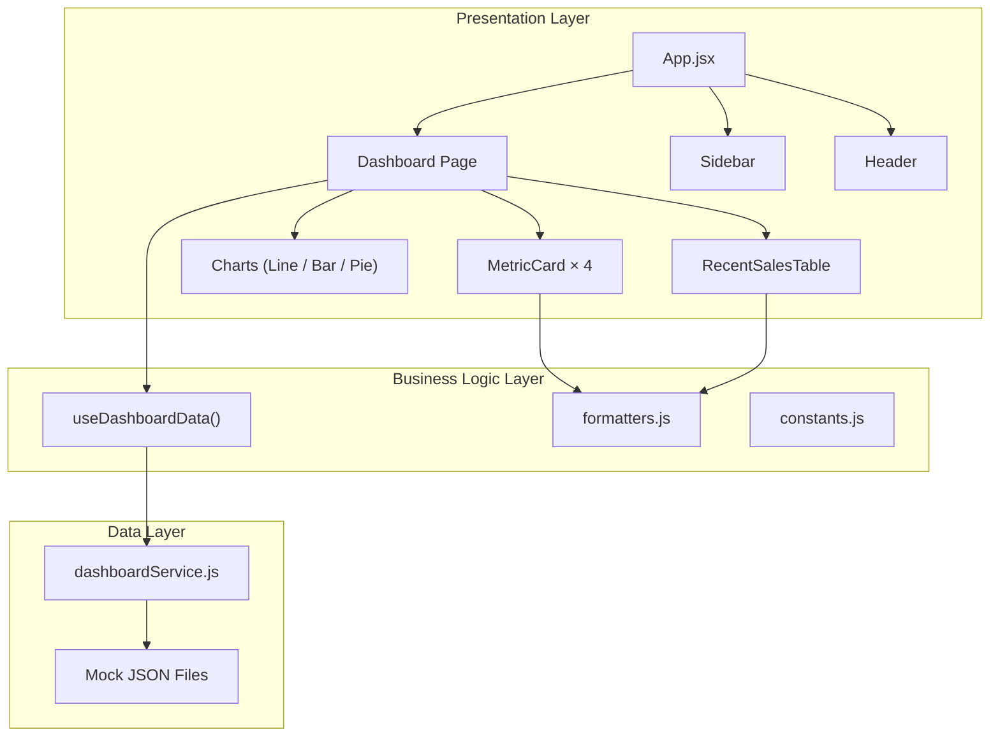

# SaaS Admin Dashboard — Architecture & Implementation Plan

A mock analytics dashboard for a fictional subscription business ("**PulseMetrics**"), showcasing revenue tracking, user signups, demographics, and recent sales data.

## Technology Decisions

| Concern | Choice | Rationale |
|---|---|---|
| Build tool | **Vite 6** | Instant HMR, native ESM, lightweight |
| UI library | **React 18** | Component model, hooks ecosystem |
| Charts | **Recharts 2** | Declarative, composable, built on D3 |
| Styling | **Vanilla CSS** + Custom Properties | Full control, zero runtime cost, design tokens |
| Testing | **Vitest + React Testing Library** | Native Vite integration, fast, jsdom |
| Icons | **Lucide React** | Lightweight, tree-shakeable icon set |
| Fonts | **Inter** (Google Fonts) | Modern, highly legible, SaaS industry standard |

---

## System Architecture



### SOLID Principles Applied

| Principle | Application |
|---|---|
| **S** — Single Responsibility | Each component renders ONE thing. Data fetching is in hooks, formatting in utils. |
| **O** — Open/Closed | `MetricCard` accepts props — extend by passing new data, not modifying internals. |
| **L** — Liskov Substitution | Chart components share a consistent prop interface (`data`, `title`, `className`). |
| **I** — Interface Segregation | Components receive only the props they need — no god objects. |
| **D** — Dependency Inversion | Components depend on `dashboardService` abstraction, not raw JSON imports. |

### Design Patterns

- **Service Layer** — `dashboardService.js` abstracts data access. Swap mock ➡ API with zero component changes.
- **Custom Hook** — `useDashboardData()` encapsulates loading state, error state, and data fetching.
- **Composition** — Layout composed via `<Sidebar>` + `<MainContent>` children, not inheritance.
- **Container / Presentational** — Dashboard page orchestrates data; child components are purely presentational.

---

## Folder Structure

```
sass-dashboard/
├── public/
│   └── favicon.svg
├── src/
│   ├── components/
│   │   ├── Layout/
│   │   │   ├── Sidebar.jsx
│   │   │   ├── Sidebar.css
│   │   │   ├── Header.jsx
│   │   │   └── Header.css
│   │   ├── Cards/
│   │   │   ├── MetricCard.jsx
│   │   │   └── MetricCard.css
│   │   ├── Charts/
│   │   │   ├── RevenueLineChart.jsx
│   │   │   ├── SignupsBarChart.jsx
│   │   │   ├── DemographicsPieChart.jsx
│   │   │   └── Charts.css
│   │   └── Tables/
│   │       ├── RecentSalesTable.jsx
│   │       └── RecentSalesTable.css
│   ├── data/
│   │   ├── revenue.js
│   │   ├── signups.js
│   │   ├── demographics.js
│   │   └── sales.js
│   ├── services/
│   │   └── dashboardService.js
│   ├── hooks/
│   │   └── useDashboardData.js
│   ├── utils/
│   │   ├── formatters.js
│   │   └── constants.js
│   ├── pages/
│   │   └── Dashboard/
│   │       ├── Dashboard.jsx
│   │       └── Dashboard.css
│   ├── App.jsx
│   ├── App.css
│   ├── index.css              ← Design tokens & global resets
│   └── main.jsx
├── tests/
│   ├── components/
│   │   ├── MetricCard.test.jsx
│   │   ├── RevenueLineChart.test.jsx
│   │   ├── SignupsBarChart.test.jsx
│   │   ├── DemographicsPieChart.test.jsx
│   │   └── RecentSalesTable.test.jsx
│   ├── hooks/
│   │   └── useDashboardData.test.jsx
│   ├── services/
│   │   └── dashboardService.test.js
│   ├── utils/
│   │   └── formatters.test.js
│   └── setup.js
├── index.html
├── package.json
├── vite.config.js
└── README.md
```

---

## Data Models

### Revenue (30-day time series)
```js
// src/data/revenue.js
{
  date: "2026-03-16",   // ISO date string
  revenue: 1250.00      // USD, daily revenue
}
```

### User Signups (monthly breakdown)
```js
// src/data/signups.js
{
  month: "Jan",          // Abbreviated month
  free: 450,             // Free-tier signups
  pro: 120               // Pro-tier signups
}
```

### Demographics (by country)
```js
// src/data/demographics.js
{
  name: "United States", // Country name
  value: 35,             // Percentage
  color: "#6366f1"       // Chart segment color
}
```

### Recent Sales
```js
// src/data/sales.js
{
  id: "TXN-001",                    // Transaction ID
  customer: "Olivia Martin",        // Customer name
  email: "olivia@example.com",      // Email
  plan: "Pro",                      // Subscription plan
  amount: 49.99,                    // Transaction amount (USD)
  date: "2026-04-10T14:30:00Z",     // ISO timestamp
  avatar: "OM"                      // Initials for avatar
}
```

### Dashboard Metrics (derived)
```js
{
  title: "Total Revenue",
  value: 45231.89,       // Raw number — formatted by utils
  change: 20.1,          // Percentage change
  trend: "up",           // "up" | "down"
  icon: "DollarSign"     // Lucide icon name
}
```

---

## Service Layer API

```js
// src/services/dashboardService.js

export const dashboardService = {
  /** @returns {Promise<Array<{date: string, revenue: number}>>} */
  getRevenueData(),

  /** @returns {Promise<Array<{month: string, free: number, pro: number}>>} */
  getSignupsData(),

  /** @returns {Promise<Array<{name: string, value: number, color: string}>>} */
  getDemographicsData(),

  /** @returns {Promise<Array<SaleRecord>>} */
  getRecentSales(),

  /** @returns {Promise<Array<MetricCard>>} */
  getMetrics(),
};
```

> [!NOTE]
> All methods return Promises to simulate async API calls. This makes the switch to a real REST/GraphQL backend a **one-file change** — only `dashboardService.js` needs updating.

---

## UI Design Direction

### Color Palette (Dark Mode)
| Token | Value | Usage |
|---|---|---|
| `--bg-primary` | `#0a0a0f` | Page background |
| `--bg-card` | `#12121a` | Card / panel surfaces |
| `--bg-sidebar` | `#0d0d14` | Sidebar background |
| `--border` | `#1e1e2e` | Subtle borders |
| `--text-primary` | `#f0f0f5` | Headings, primary text |
| `--text-secondary` | `#8888a0` | Labels, secondary text |
| `--accent-blue` | `#6366f1` | Primary accent (Indigo) |
| `--accent-emerald` | `#10b981` | Positive/success indicators |
| `--accent-rose` | `#f43f5e` | Negative/danger indicators |
| `--accent-amber` | `#f59e0b` | Warning / neutral indicators |
| `--accent-violet` | `#8b5cf6` | Charts secondary color |

### Typography
- **Font Family:** `'Inter', sans-serif`
- **Heading scale:** 2rem / 1.5rem / 1.25rem / 1rem
- **Body:** 0.875rem, line-height 1.6

### Visual Features
- Glassmorphism card effects (`backdrop-filter: blur`)
- Subtle gradient borders on hover
- Smooth micro-animations (fade-in, scale on hover)
- Animated number counters on metric cards
- Responsive grid layout (CSS Grid + Flexbox)

---

## Implementation Milestones

### Milestone 1: Project Scaffolding & Design System
**Scope:** Vite + React project init, dependency installation, global CSS with all design tokens, font loading.

**Files:**
- `package.json`, `vite.config.js`, `index.html`
- `src/index.css` (design tokens, resets, typography)
- `src/main.jsx`, `src/App.jsx`, `src/App.css`

**Deliverable:** App runs with styled empty shell. ✅ Testable independently.

---

### Milestone 2: Layout Shell (Sidebar + Header)
**Scope:** Sidebar navigation with icons, header with search/avatar, responsive CSS Grid layout.

**Files:**
- `src/components/Layout/Sidebar.jsx` + `.css`
- `src/components/Layout/Header.jsx` + `.css`
- Update `src/App.jsx` to compose layout

**Deliverable:** Navigable shell with sidebar and header. ✅ Testable independently.

---

### Milestone 3: Data Layer & Metric Cards
**Scope:** Mock data files, service layer, custom hook, 4 KPI metric cards (Total Revenue, Active Users, Active Subscriptions, Churn Rate).

**Files:**
- `src/data/*.js` (all mock data)
- `src/services/dashboardService.js`
- `src/hooks/useDashboardData.js`
- `src/utils/formatters.js` + `constants.js`
- `src/components/Cards/MetricCard.jsx` + `.css`
- `src/pages/Dashboard/Dashboard.jsx` + `.css`

**Deliverable:** Dashboard page showing 4 animated metric cards with real-looking data. ✅ Testable independently.

---

### Milestone 4: Charts (Recharts Integration)
**Scope:** Revenue Line Chart, Signups Bar Chart, Demographics Pie Chart — all with tooltips, legends, responsive containers, and styled to match dark theme.

**Files:**
- `src/components/Charts/RevenueLineChart.jsx`
- `src/components/Charts/SignupsBarChart.jsx`
- `src/components/Charts/DemographicsPieChart.jsx`
- `src/components/Charts/Charts.css`

**Deliverable:** All 3 charts rendering with mock data on the dashboard. ✅ Testable independently.

---

### Milestone 5: Recent Sales Table
**Scope:** Styled data table with customer avatar, name, email, plan badge, amount, and date.

**Files:**
- `src/components/Tables/RecentSalesTable.jsx` + `.css`

**Deliverable:** Sales table integrated into the dashboard page. ✅ Testable independently.

---

### Milestone 6: Polish & Animations
**Scope:** Micro-interactions (hover effects, card entrance animations, number counters), responsive breakpoints for tablet, final visual QA.

**Files:** CSS updates across all components, minor JSX tweaks for animation classes.

**Deliverable:** Production-polished, responsive dashboard. ✅ Visual QA.

---

### Milestone 7: Testing Suite
**Scope:** Full test coverage — component rendering, hook behavior, service layer, utility functions.

**Files:**
- `tests/setup.js`
- `tests/components/*.test.jsx`
- `tests/hooks/*.test.jsx`
- `tests/services/*.test.js`
- `tests/utils/*.test.js`

**Deliverable:** All tests passing, coverage report generated. ✅ CI-ready.

---

### Milestone 8: Documentation & Final Review
**Scope:** README with setup instructions, screenshots, architecture overview. Final code review pass.

**Files:**
- `README.md`

**Deliverable:** Portfolio-ready project. ✅ Complete.

---

## Verification Plan

### Automated Tests
```bash
# Run full test suite with coverage
npx vitest run --coverage

# Run in watch mode during development
npx vitest
```

**Coverage targets:**
- Utility functions: **100%**
- Service layer: **100%**
- Custom hooks: **≥ 90%**
- Components: **≥ 80%** (rendering + prop validation)

### Manual Verification
- Visual QA via `npm run dev` at each milestone — browser inspection of layout, charts, responsiveness
- Browser recording of the final dashboard for walkthrough artifact
- Verify responsive behavior at `1440px`, `1024px`, and `768px` breakpoints

### Build Validation
```bash
npm run build    # Ensure production build completes with zero warnings
npm run preview  # Verify production bundle serves correctly
```
